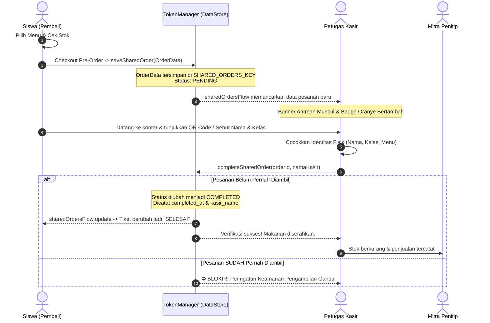

# Dokumentasi Lengkap Sistem & Arsitektur SIPeKa
**Sistem Informasi Pelayanan Kantin SMKN 8 Jakarta**

> **Versi Dokumentasi**: 2.0 (Edisi Lengkap: Kasir, Pembeli, Penitip, Admin, Real-time Sync & Anti-Fraud)  
> **Target Pengembang**: Tim Developer, Guru Pembina, Administrator, dan AI Coding Agents.

---

## 📌 1. Ringkasan Eksekutif & Tujuan Proyek

**SIPeKa** (*Sistem Informasi Pelayanan Kantin*) adalah aplikasi Android native modern yang dirancang khusus untuk mendigitalkan seluruh ekosistem transaksi, manajemen laci kas, monitoring dagangan titipan siswa/guru, dan pemesanan makanan di SMKN 8 Jakarta.

Aplikasi ini mengintegrasikan **4 peran pengguna** dalam satu ekosistem terpadu:
1. **Siswa (Pembeli)**: Memilih makanan dari katalog kantin, melakukan transaksi pre-order, memperoleh voucher tiket QR Code instan, melacak riwayat pesanan pribadi, dan mengedit informasi profil mandiri.
2. **Kasir (Petugas POS)**: Membuka shift dengan modal awal (Clock-In), melayani transaksi tunai di tempat, memonitor antrean pre-order siswa secara real-time, memverifikasi voucher QR, menyerahkan makanan dengan proteksi anti-fraud, dan menutup shift (Clock-Out) dengan rekonsiliasi kas.
3. **Penitip (Mitra Dagangan Siswa/Guru)**: Mengunggah produk titipan, memantau sisa stok dan produk terjual, mengecek akumulasi bagi hasil bersih, serta mengelola profil toko titipan secara mandiri.
4. **Admin (Guru Pembina / Manajemen Sekolah)**: Mengawasi rekapan kas masuk, memvalidasi dan menyetujui shift kasir, mencairkan bagi hasil titipan, serta mengelola akun seluruh pengguna sekolah.

---

## 🏗️ 2. Arsitektur Teknis & Stack Teknologi

| Komponen | Spesifikasi / Library | Peran dalam Sistem |
| :--- | :--- | :--- |
| **Platform** | Android Native (API Level 24+ s.d 34) | Kompatibel dengan mayoritas smartphone siswa & tablet kasir |
| **Bahasa** | Kotlin (JDK 11) | Null safety, Coroutines, Flow |
| **UI Toolkit** | Jetpack Compose + Material 3 | Declarative UI, animasi fluid, design token kustom |
| **Arsitektur UI** | MVVM (Model-View-ViewModel) | Pemisahan logika bisnis dari UI, StateFlow reaktif |
| **Penyimpanan Lokal** | DataStore Preferences | Penyimpanan JWT, profil peran, riwayat lokal, dan shared pre-orders |
| **Networking** | Retrofit2 + OkHttp3 + Gson | REST API Client dengan Auth Header Interceptor otomatis |
| **Image Loading** | Coil Compose (`io.coil-kt:coil-compose`) | Cache gambar async memory & disk dari backend |
| **Barcode / QR** | ZXing Core (`com.google.zxing:core`) | Generator bitmap QR Code resolusi tinggi untuk tiket pre-order |
| **Navigasi** | Jetpack Navigation Compose | Single Activity NavHost dengan Role-Based Access Control |

---

## 📁 3. Struktur Direktori Proyek

```text
d:/AndroidStudioProjects/SIPeKa/
├── app/
│   ├── src/main/java/com/smkn8jkt/sipeka/
│   │   ├── MainActivity.kt                     # Activity Utama Android
│   │   ├── MainViewModel.kt                    # Helper debugger & inspeksi API
│   │   │
│   │   ├── data/
│   │   │   ├── model/
│   │   │   │   ├── AuthModels.kt               # DTO Login, Register, UserData, Role
│   │   │   │   └── PosModels.kt                # DTO Produk, Transaksi, Shift, OrderData, Bagi Hasil
│   │   │   └── remote/
│   │   │       ├── ApiClient.kt                # Instance Retrofit, Logging, Header Interceptor
│   │   │       ├── ApiService.kt               # Kontrak 18+ endpoint REST API backend
│   │   │       └── TokenManager.kt             # DataStore Preferences (Auth, Profil, Shared Orders)
│   │   │
│   │   ├── navigation/
│   │   │   └── AppNavigation.kt                # NavHost, rute layar, otentikasi role guard
│   │   │
│   │   ├── ui/
│   │   │   ├── components/
│   │   │   │   └── SipekaComponents.kt         # Tombol, TextField, Badge, Komponen Reusable
│   │   │   │
│   │   │   ├── screens/
│   │   │   │   ├── admin/                      # Modul Guru Pembina & Admin Sekolah
│   │   │   │   │   ├── AdminDashboardScreen.kt
│   │   │   │   │   └── AdminViewModel.kt
│   │   │   │   ├── auth/                       # Modul Autentikasi Masuk & Daftar
│   │   │   │   │   ├── LoginScreen.kt
│   │   │   │   │   ├── RegisterScreen.kt
│   │   │   │   │   └── AuthViewModel.kt
│   │   │   │   ├── pembeli/                    # Modul Siswa / Pembeli Pre-Order
│   │   │   │   │   ├── PembeliHomeScreen.kt    # Beranda, Keranjang, Pesanan Saya, Profil Mandiri
│   │   │   │   │   └── PembeliViewModel.kt     # Logika pemesanan, validasi stok, QR ticket
│   │   │   │   ├── penitip/                    # Modul Siswa / Mitra Penitip Makanan
│   │   │   │   │   ├── PenitipDashboardScreen.kt # Monitoring penjualan, bagi hasil, profil toko
│   │   │   │   │   └── PenitipViewModel.kt
│   │   │   │   ├── pos/                        # Modul Kasir POS Kantin
│   │   │   │   │   ├── HomeScreen.kt           # POS Catalog, Antrean Pre-Order, Scan QR, Shift
│   │   │   │   │   ├── CheckoutBottomSheet.kt  # Modal kembalian tunai & bayar cepat
│   │   │   │   │   ├── RiwayatScreen.kt        # Rekap penjualan kasir, rincian nota & verifikasi
│   │   │   │   │   ├── ProfilKasirScreen.kt    # Profil kasir, edit NIP/nama, jam sistem, Clock-Out
│   │   │   │   │   ├── PosViewModel.kt         # Logika transaksi, shift, dan verifikasi pre-order
│   │   │   │   │   └── SipekaProductCard.kt    # Komponen kartu produk POS
│   │   │   │   └── splash/
│   │   │   │       └── SplashScreen.kt         # Pemeriksaan sesi & routing otomatis
│   │   │   │
│   │   │   └── theme/                          # Design System Tokens
│   │   │       ├── Color.kt                    # Palet Mocha Warm Canvas & Vibrant Orange
│   │   │       ├── Theme.kt                    # Material 3 Theme setup
│   │   │       └── Type.kt                     # Tipografi teks
│   │   │
│   │   └── util/
│   │       └── QrCodeUtil.kt                   # ZXing generator QR Code Bitmap
│   │
│   └── build.gradle.kts                        # Dependensi modul aplikasi
│
├── .agents/
│   └── rules/
│       └── sipeka-architecture.md              # Aturan & konteks resmi untuk AI Coding Agent
├── AGENTS.md                                   # Quick reference panduan AI Agent
├── DOKUMENTASI_SIPeKa.md                       # Dokumentasi teknis komprehensif ini
└── .gitignore                                  # Aturan keamanan repo (anti kebocoran rahasia)
```

---

## 👥 4. Alur Kerja & Spesifikasi Setiap Peran Pengguna

### 1. 🎓 Siswa (Pembeli / Pre-Order)
- **Katalog & Navigasi Beranda**:
  - Filter kategori cepat (*Semua, Makanan, Minuman, Snack*) dan bilah pencarian real-time.
  - Tampilan visual sisa stok: stok normal, stok tipis, dan badge stok habis.
- **Keranjang Belanja & Validasi Stok (Anti-Jahil #1)**:
  - Pembeli **tidak dapat** memesan melebihi stok fisik yang tersedia.
  - Tombol tambah otomatis terkunci saat stok habis untuk mencegah pesanan fiktif/minus.
- **Voucher Pre-Order & QR Code**:
  - Saat checkout, sistem meng-generate kode unik `QR-PREORDER-XXXX` dan ID transaksi.
  - Tiket QR Code di-render secara grafis menggunakan library ZXing `QrCodeUtil`.
  - Data pesanan mencantumkan: Nama Siswa, Kelas, NISN, daftar menu pesanan, dan total harga.
- **Riwayat Pesanan Terisolasi (Anti-Intip Privasi)**:
  - Tab Pesanan Saya hanya menampilkan transaksi milik akun siswa yang sedang login.
  - Tiket QR yang sudah selesai/diambil diberi penanda hijau `SELESAI / DIAMBIL`.
- **Pembatalan Pesanan Mandiri**:
  - Siswa dapat membatalkan pesanan pre-order secara mandiri selama status masih `PENDING` jika terjadi kekeliruan pesanan sebelum kasir menyiapkan makanan.
- **Bukti Fisik Resmi Serah-Terima**:
  - Saat pesanan selesai diserahkan, tiket menampilkan stempel resmi nama petugas kasir yang melayani dan waktu serah-terima (`completedAt`).
- **Edit Profil Akun Mandiri**:
  - Siswa dapat mengubah Nama Lengkap, Kelas, NISN, dan Password akun secara mandiri.

---

### 2. 🏪 Kasir (Petugas POS Kantin)
- **Manajemen Shift (Clock-In & Clock-Out)**:
  - Sebelum melayani transaksi, kasir **wajib** melakukan Clock-In dengan memasukkan modal awal laci.
  - Jika shift belum dibuka, sistem menonaktifkan transaksi POS dan melarang penyerahan makanan pre-order.
- **Transaksi Tunai Cepat & Kalkulasi Kembalian**:
  - Preset nominal uang cepat (`Uang Pas`, `10rb`, `20rb`, `50rb`, `100rb`).
  - Kalkulasi kembalian otomatis dengan validasi uang kurang.
- **Antrean Pre-Order Siswa Masuk Real-Time**:
  - Badge angka oranye dan banner notifikasi muncul seketika di layar Beranda Kasir jika ada pesanan siswa yang belum diambil.
  - Kasir dapat menekan tombol antrean untuk melihat daftar siswa yang menunggu.
- **Pemindai Kamera QR & Galeri Cerdas (Camera QR Scanner)**:
  - **Tombol "Buka Kamera"**: Kasir dapat membuka kamera perangkat secara langsung untuk mengambil foto tiket QR siswa di depan konter.
  - **Tombol "Pilih Gambar"**: Kasir dapat mengimpor file foto / screenshot kode QR dari galeri perangkat.
  - **Multi-Binarizer Decoding ZXing**: Menggunakan algoritma *HybridBinarizer* dan *GlobalHistogramBinarizer* sehingga mampu mendeteksi QR Code dari layar HP siswa meski dalam kondisi silau, redup, atau foto agak miring.
- **Modal Verifikasi Pre-Order & Anti-Fraud**:
  - Kasir dapat mencari pesanan lewat scan kamera, galeri, ketik kode QR, ataupun langsung memilih dari daftar antrean siswa.
  - Menampilkan identitas lengkap pemesan (**Nama Siswa, Kelas, NISN**) agar kasir dapat mencocokkan secara lisan saat siswa datang ke meja kasir.
  - Tombol aksi `Verifikasi & Serahkan Makanan` langsung mengunci status pesanan menjadi `COMPLETED`.
  - **Proteksi Pengambilan Ganda (Anti-Jahil #2)**: Jika ada pihak yang mencoba mengklaim kembali tiket QR yang sudah diserahkan, sistem menampilkan peringatan keamanan keras:
    > *"⛔ PERINGATAN KEAMANAN: Pesanan sudah pernah diambil sebelumnya! Jangan serahkan makanan ganda."*
- **Edit Profil Kasir**:
  - Kasir dapat mengubah Nama Petugas, NIP, dan Password akun pada tab Profil.

---

### 3. 🍱 Penitip (Mitra Dagangan Siswa / Guru)
- **Monitoring Penjualan Real-Time**:
  - Menampilkan ringkasan sisa stok makanan, jumlah item terjual, dan harga jual per porsi.
- **Kalkulasi Bagi Hasil Otomatis & Proteksi Finansial (Anti-Celah)**:
  - Rumus bagi hasil: `(Harga Jual - Rp 1.000 Kas PKK) × Jumlah Terjual`.
  - **Validasi Minimum Harga**: Penitip wajib menetapkan harga di atas Rp 1.000 (biaya operasional kas sekolah), mencegah risiko pendapatan minus atau saldo nol.
  - Kartu pendapatan belum dicairkan (*unpaid earnings*) dengan visual gradien espresso.
- **Manajemen Produk Titipan**:
  - Form penambahan produk dengan unggah foto, harga jual, deskripsi, dan stok awal.
  - Tombol hapus produk titipan dengan konfirmasi keamanan.
- **Edit Profil Toko & Kontak Mandiri**:
  - Penitip dapat mengubah Nama Penanggung Jawab, Nama Usaha/Brand Kantin, NIP/Nomor WhatsApp, dan Password baru.

---

### 4. 👨‍🏫 Admin (Guru Pembina / Manajemen Sekolah)
- **Dashboard Finansial**:
  - Menampilkan total kas laba sekolah dari margin Rp 1.000 per transaksi.
- **Validasi Shift & Setoran Kasir**:
  - Guru Pembina memverifikasi selisih fisik kas akhir kasir sebelum shift ditutup resmi.
- **Pencairan Saldo Penitip**:
  - Daftar permohonan penarikan dana dengan tombol persetujuan transfer/tunai.
- **Manajemen Akun Pengguna**:
  - Menyetujui pendaftaran akun baru, mengubah hak akses (role), mereset kata sandi, dan menonaktifkan akun yang melanggar.

---

## ⚡ 5. Sistem Koneksi Antar Peran Real-Time (Shared State Bus)

SIPeKa menghubungkan pembeli dan kasir menggunakan arsitektur **Shared Reactive Event Bus** yang terintegrasi di `TokenManager.kt`:



---

## 🛡️ 6. Matriks Keamanan & Anti-Fraud (Anti-Jahil)

| Potensi Tindakan Jahil / Fraud | Lapisan Pertahanan SIPeKa | Dampak Sistem |
| :--- | :--- | :--- |
| **Siswa memesan barang yang stoknya sudah habis** | Validasi stok ketat di `PembeliViewModel.checkoutPreOrder()` dan tombol dinonaktifkan di UI. | Checkout ditolak sebelum pesanan dibuat. |
| **Siswa mengambil makanan dua kali dengan screenshot QR** | `TokenManager.completeSharedOrder()` mengecek status `isCompleted`. Sekali diserahkan, token langsung dikunci permanen. | Layar kasir menampilkan peringatan merah keras: *"⛔ PERINGATAN KEAMANAN: Pesanan SUDAH PERNAH DIAMBIL sebelumnya!"*. |
| **Orang lain mengaku-ngaku sebagai pemesan** | Modal kasir menampilkan **Nama Lengkap, Kelas, dan NISN** siswa. Kasir dapat mencocokkan identitas siswa secara verbal sebelum serah-terima. | Mencegah salah serah atau klaim palsu oleh siswa lain. |
| **Penyerahan makanan di luar jam operasional kantin** | `PosViewModel.verifyAndCompletePreOrder()` mewajibkan kasir memiliki shift aktif (`isShiftOpen == true`). | Verifikasi ditolak: *"⛔ Shift kasir belum dibuka! Harap Clock-In terlebih dahulu."* |
| **Melihat atau mengklaim pesanan siswa lain** | `PembeliViewModel.fetchMyOrders()` menyaring daftar hanya untuk ID/NISN akun siswa yang sedang terautentikasi. | Siswa lain tidak dapat mengintip nota maupun kode QR milik orang lain. |

---

## 🔒 7. Keamanan Repositori Git & Pencegahan Kebocoran Data (Git-Leak Prevention)

Untuk memastikan kode aman dipublikasikan ke GitHub publik/privat tanpa membocorkan kredensial:

1. **File yang Dikecualikan (`.gitignore`)**:
   - `local.properties`: Menyembunyikan path SDK Android lokal pengguna.
   - `*.jks`, `*.keystore`, `*.key`, `*.pem`, `*.p12`: Mencegah kebocoran sertifikat signing rilis APK.
   - `.env`, `.env.*`, `secrets.properties`, `credentials.json`, `google-services.json`: Melindungi API key rahasia.
   - `.idea/`, `*.iml`, `.vscode/`: Mengabaikan konfigurasi spesifik mesin pengembang.
   - `build/`, `.gradle/`: Mengabaikan binari kompilasi sementara.
2. **Penyimpanan Token & Password**:
   - Token JWT dan password tidak pernah di-hardcode ke dalam file Java/Kotlin.
   - Seluruh data otentikasi disimpan aman di Android DataStore Preferences berbasis sandbox lokal aplikasi.

---

## 🎨 8. Design System & Token Warna (Warm Mocha Stitch Canvas)

Aplikasi mengadopsi bahasa visual modern bertema kopi hangat (*Warm Espresso & Mocha*) dengan aksen *Vibrant Orange*:

```kotlin
val BgDarkEspresso   = Color(0xFF2B1810) // Header utama & App Bar
val BtnDarkChocolate = Color(0xFF451A0D) // Tombol primer & teks kontras tinggi
val BtnMocha         = Color(0xFF8C5338) // Aksen brand & sub-elemen
val BgWarmTan        = Color(0xFFE8D7C8) // Tag, chip aktif, border lembut
val CardCreamWhite   = Color(0xFFFFFDF9) // Latar belakang kartu kontainer
val BgLightCanvas    = Color(0xFFF7F2EC) // Latar belakang layar penuh
val SegmentBg        = Color(0xFFEFE8DF) // Kontainer toggle tab
val BorderStitch     = Color(0xFFE4D8CA) // Garis batas halus 1dp
val GreenSuccess     = Color(0xFF2E7D32) // Status sukses & lunas
val VibrantOrange    = Color(0xFFF95721) // Aksen utama Pre-Order Siswa
```

---

## 🚀 9. Panduan Membangun & Menjalankan Proyek (Build Guide)

### Prasyarat
- Android Studio Ladybug / Meerkat (atau versi terbaru).
- JDK 11 atau JDK 17 terkonfigurasi pada `JAVA_HOME`.
- Koneksi internet untuk mengunduh dependensi Gradle pada build awal.

### Menjalankan via Terminal
```powershell
# 1. Bersihkan cache build lama
.\gradlew.bat clean

# 2. Kompilasi Kotlin Debug
.\gradlew.bat :app:compileDebugKotlin

# 3. Rakit APK Debug
.\gradlew.bat :app:assembleDebug

# 4. Instal ke Device/Emulator yang aktif
.\gradlew.bat :app:installDebug
```

---

## 🔒 10. Panduan Aman Melakukan Push ke Git / GitHub (Zero-Leak Git Workflow)

Untuk memastikan kode aman dipublikasikan ke GitHub publik maupun privat tanpa risiko kebocoran:

### 📋 Checklist Sebelum Push (Pre-Push Verification)
1. **Periksa File Sensitif**: Pastikan file berikut tidak muncul di daftar `git status`:
   - `local.properties` (berisi direktori SDK komputer pengguna)
   - `*.jks`, `*.keystore` (kunci penandatanganan aplikasi rilis)
   - `.env`, `secrets.properties` (kredensial backend rahasia)
   - Direktori `build/`, `.gradle/`, `.idea/workspace.xml`
2. **Uji Validasi `.gitignore`**:
   Jalankan:
   ```powershell
   git status --ignored -s
   ```
   Pastikan file rahasia bertanda `!!` (ignored), BUKAN `??` (untracked) atau `M` (modified).
3. **Periksa String Rahasia Hardcoded**:
   Pastikan tidak ada token JWT statis, password pengguna, atau API key yang tertulis secara langsung di dalam kode Kotlin.

### 🚀 Perintah Git Rekomendasi
```powershell
# 1. Tinjau perubahan yang siap di-stage
git status

# 2. Tambahkan semua perubahan kode dan dokumentasi
git add .

# 3. Buat commit dengan pesan terstruktur
git commit -m "feat: complete multi-role integration, real-time shared pre-order bus, self-profile editing, and anti-fraud security"

# 4. Push ke repositori remote utama
git push origin master
```

---

## 🔄 11. Siklus Hidup Tiket QR & Verifikasi Pre-Order (QR Lifecycle)

```text
[SISWA: Checkout Pre-Order]
       │
       ▼
 [STATUS: PENDING] ──────────────────────────────────────────────┐
       │                                                         │
       ├─ Tiket tersimpan di DataStore (SHARED_ORDERS_KEY)       │
       ├─ Tiket muncul di tab "Pesanan Saya" (QR & Status Kuning)│ (Real-Time Flow)
       └─ Terpancar ke antrean Kasir POS                         │
                                                                 │
                                                                 ▼
                                                  [KASIR: Notifikasi Antrean]
                                                         │
                                                         ├─ Badge counter oranye bertambah
                                                         └─ Banner antrean siswa tampil di layar
                                                                 │
                                                                 ▼
[SISWA: Datang ke Meja Kasir] ──────────────────────────── [KASIR: Verifikasi Fisik]
- Siswa menunjukkan QR Code                               - Kasir mencocokkan Nama, Kelas, & NISN
- Siswa menyebutkan nama / kelas                          - Kasir menekan "Verifikasi & Serahkan"
                                                                 │
                                                                 ▼
                                                    [SISTEM: Anti-Fraud Check]
                                                      Apakah sudah pernah diambil?
                                                      ├── YA ──> ⛔ BLOKIR! Tolak ganda
                                                      └── TIDAK ─> ✅ PROSES
                                                                     │
                                                                     ▼
                                                             [STATUS: COMPLETED]
                                                                     │
                                                                     ├─ Kasir: Pesanan selesai
                                                                     ├─ Stok Penitip: Berkurang
                                                                     └─ Siswa: Tiket berubah hijau
```

---

## 🧾 11.1 Integrasi Riwayat Transaksi & Rekap Shift Kasir
- **Shift Binding Otomatis**: Setiap kali pesanan pre-order siswa diserahkan melalui scan QR atau pencarian kode order, sistem menyematkan `shiftId = activeShiftId`, `completedAt = nowIso`, dan `kasirName = namaKasir`. Hal ini memastikan pesanan langsung tampil di tab **"Shift Aktif"** dan tidak hilang dari laporan penutupan shift kasir.
- **Kategori Filter Tab**:
  1. `Shift Aktif`: Menampilkan seluruh transaksi (QR maupun tunai) yang diproses pada sesi shift kasir yang sedang berjalan.
  2. `Pre-Order QR`: Menampilkan riwayat voucher pesanan siswa sekolah (QR Code).
  3. `Kasir Tunai`: Menampilkan transaksi belanja langsung di tempat (*dine-in/takeaway cash*).
  4. `Hari Ini`: Menampilkan transaksi operasional per tanggal hari ini.
  5. `Semua`: Menampilkan seluruh arsip transaksi.
- **Pencarian Multi-Parameter**: Kasir dapat mencari riwayat secara fleksibel melalui ID transaksi, nama siswa, NISN, kode voucher QR, nama menu produk yang dibeli, maupun nama petugas kasir.
- **Perhitungan Saldo Bersih**: Bento Card menghitung penerimaan riil kasir hanya dari pesanan yang lunas (`isCompleted == true`), memisahkan alokasi **Kas PKK Sekolah** (`Rp 1.000 / transaksi`) dan **Hak Penitip** secara transparan.

---

## 🌐 12. Daftar Endpoint REST API yang Terhubung

| HTTP Method | Endpoint | Fungsi |
| :--- | :--- | :--- |
| `POST` | `/api/auth/login` | Otentikasi pengguna & penerbitan token JWT |
| `POST` | `/api/auth/register` | Pendaftaran akun baru (Siswa / Penitip) |
| `PUT` | `/api/users/{id}` | Pembaruan profil mandiri (Nama, NISN/NIP, Kelas, Password) |
| `GET` | `/api/products` | Pengambilan daftar katalog produk dan stok kantin |
| `POST` | `/api/products` | Penambahan produk titipan baru oleh Mitra Penitip |
| `DELETE` | `/api/products/{id}` | Penonaktifan / penghapusan produk titipan |
| `GET` | `/api/orders` | Pengambilan seluruh riwayat transaksi |
| `POST` | `/api/orders` | Pembuatan transaksi pesanan / pre-order baru |
| `POST` | `/api/orders/{id}/complete` | Penyelesaian penyerahan makanan pre-order oleh kasir |
| `GET` | `/api/shifts/active` | Pengecekan status shift kasir yang sedang aktif |
| `POST` | `/api/shifts/clock-in` | Pembukaan shift kasir dengan input modal awal laci |
| `POST` | `/api/shifts/clock-out` | Penutupan shift kasir dengan rekonsiliasi kas fisik |

---

## 🏷️ 13. Arsitektur Kategori Produk & Dropdown Penitip (Multi-Role Filtering)

### A. Penyebab Masalah Filter Sebelumnya (Root Cause Analysis)
1. **Ketidaksesuaian Nilai Default POS**: `PosViewModel` sebelumnya menginisialisasi `_selectedCategory = "Semua Menu"`, sedangkan `HomeScreen` memeriksa kesamaan `selectedCategory == "Semua"`. Hal ini menyebabkan evaluasi `product.category.equals("Semua Menu")` bernilai salah dan menyembunyikan semua produk saat peluncuran awal.
2. **Ketiadaan Input Kategori Penitip**: Dialog penambahan produk mitra penitip sebelumnya hanya menerima input nama, harga, deskripsi, dan stok tanpa kolom kategori sehingga tersimpan sebagai `"Umum"` atau `null`.
3. **Pencocokan String Parsial Rentan Gagal**: Produk berkategori `"Umum"` tidak cocok dengan chip filter `"Makanan"`, `"Minuman"`, atau `"Snack"`.

### B. Solusi Cerdas yang Diimplementasikan
1. **Normalisasi Pintar (`effectiveCategory`)**: Pada `ProductResponse`, ditambahkan computed property `effectiveCategory` yang memetakan kategori secara andal. Jika bernilai null/"Umum", sistem mendeteksi nama produk (misal: "Es Teh", "Kopi", "Jus" otomatis menjadi `"Minuman"`; "Risol", "Keripik", "Pastel" menjadi `"Snack"`; "Paket Hemat" menjadi `"Paket"`; lainnya default `"Makanan"`).
2. **Material 3 Dropdown & Preset Chips untuk Penitip**: Komponen `SipekaDropdownField` dan 4 tombol preset (`Makanan`, `Minuman`, `Snack`, `Paket`) disematkan pada dialog tambah produk dengan validasi margin kas sekolah Rp 1.000.
3. **Filter & Pencarian di Dashboard Penitip**: Mitra penjual kini memiliki bar pencarian dan chip filter kategori mandiri untuk memantau sisa stok dan produk terjual.
4. **Keseragaman Chip Filter Antar Peran**: Kasir (POS) dan Siswa (Pembeli) kini menggunakan standar kategori seragam: `listOf("Semua", "Makanan", "Minuman", "Snack", "Paket")`.

---

## 📷 14. Pemindai QR Otomatis dalam Aplikasi (In-App Live Scanner Popup)

### A. Latar Belakang & Transformasi UX
Sebelumnya, pemindaian voucher QR pre-order di kasir mengandalkan `ActivityResultContracts.TakePicturePreview()` yang meluncurkan aplikasi kamera eksternal sistem Android dan mengharuskan petugas menekan tombol jepret foto manual.

Sistem kini telah ditingkatkan menjadi **Popup Dialog Pemindai Otomatis di Dalam Aplikasi (In-App Live Scanner Modal)** menggunakan **CameraX (`ImageAnalysis`) + ZXing Decoder Engine**:
1. **Tanpa Buka Kamera Eksternal**: Kamera langsung aktif di dalam popup dialog antarmuka SIPeKa tanpa berpindah aplikasi.
2. **Deteksi Otomatis Real-time (Auto-Detect Zero Click)**: Begitu kode QR voucher siswa tertangkap di bingkai viewfinder kamera, mesin `ImageAnalysis` langsung memproses bitmap frame dan mengekstrak kode secara instan tanpa perlu menekan tombol shutter/jepret apapun.
3. **Konfirmasi Visual & Transisi Mulus**: Saat QR terbaca, bingkai viewfinder berubah menjadi hijau dengan ikon centang sukses dan kode otomatis dimasukkan ke verifikasi pesanan kasir (`showQrDialog`). Petugas dapat langsung mencocokkan identitas fisik siswa (Nama, Kelas, NISN) dan menyerahkan makanan dengan aman.
4. **Fitur Pendukung Kasir**:
   - **Tombol Senter (Flashlight Toggle)**: Membantu pemindaian dalam kondisi pencahayaan kantin yang redup.
   - **Pilihan Unggah Galeri**: Jika siswa menunjukkan tangkapan layar voucher via ponsel lain atau aplikasi perpesanan.
   - **Animasi Laser Viewfinder**: Garis laser pemindai dinamis dengan 4 sudut bingkai *Warm Mocha Stitch*.

---

## 📱 15. Arsitektur Edge-to-Edge & Proteksi Camera Cutout (Safe Insets & Ergonomis Mobile Multi-Device)

### A. Analisis Masalah Tampilan Layar (Root Cause)
1. **Target SDK 37 & Android 15 Edge-to-Edge**: Android 15 memberlakukan rendering layar penuh (*edge-to-edge*) secara default. Komponen `Surface` kustom pada header atas (`HomeScreen`, `RiwayatScreen`, `ProfilKasirScreen`) tidak mengonsumsi *status bar insets*, sehingga lubang kamera depan (*punch-hole* / *cutout notch*) menutupi teks penting seperti nama toko "PKK Mart", badge "POS #01", status shift, dan tombol aksi.
2. **Keterbatasan Tinggi Navigasi Bawah**: Terdapat pembatasan tinggi paksa `modifier = Modifier.height(64.dp)` pada `NavigationBar` Material 3 di beberapa layar, yang membuat label tab terpotong atau terdesak oleh *gesture pill* / 3 tombol navigasi sistem Android, sehingga tata letak terlihat tidak penuh (*tidak full* / terpotong).
3. **Penataan Layar Riwayat POS**: Seluruh konten rekap bento, pencarian, dan `LazyColumn` sebelumnya terperangkap dalam parameter `topBar` pada `RiwayatScreen`, menyebabkan inkonsistensi rendering *scroll* dan area layar yang tidak terisi penuh.

### B. Solusi Arsitektur yang Diterapkan
1. **Aktivasi Global `enableEdgeToEdge()`**: Diinisialisasi pada `MainActivity.kt` sebelum `setContent`, memastikan seluruh sistem insets (status bars, navigation bars, display cutout, IME) tersalurkan dengan konsisten di Android 10 hingga 15+.
2. **Header Bleed-Through dengan `statusBarsPadding()`**:
   - Kontainer `Surface` berwarna espresso gelap tetap membentang penuh ke tepi paling atas layar (*edge-to-edge bleed*), memberikan nuansa status bar yang mewah dan menyatu.
   - Elemen interaktif di dalamnya (nama kasir, tombol sync, teks brand) dilindungi dengan `Modifier.statusBarsPadding()`, sehingga otomatis turun secara aman di bawah posisi lubang kamera ponsel manapun (tengah, kiri, maupun *pill notch*).
3. **Penyatuan Cutout pada Layar Siswa (`PembeliHomeScreen`)**:
   - `Scaffold` pembeli menggunakan konfigurasi `contentWindowInsets = WindowInsets.statusBars.union(WindowInsets.displayCutout)`.
   - Ucapan "Hai, Siswa", kelas, dan bar pencarian bulat selalu berada pada zona aman visual yang ergonomis dan bebas dari benturan fisik lubang kamera.
4. **Navigasi Bawah Ergonomis & Responsif**:
   - Menghapus pembatasan `height(64.dp)` pada `HomeScreen`, `RiwayatScreen`, `ProfilKasirScreen`, dan `AdminDashboardScreen`. `NavigationBar` kini secara dinamis beradaptasi dengan *system navigation bars* bawaan ponsel, menampilkan ikon 24dp dan label tebal dengan ruang sentuh yang nyaman.
   - `RiwayatScreen` kini memiliki `NavigationBar` 3-tab persisten yang seragam dengan layar Kasir lainnya.
5. **Proteksi Dialog & FAB Melayang**:
   - Tombol tambah produk penitip (`FloatingActionButton`) dilengkapi `Modifier.navigationBarsPadding()` agar tidak tertutup bilah navigasi gestur.
   - `LiveQrScannerPopup`, `LoginScreen`, `RegisterScreen`, dan `SplashScreen` menggunakan `Modifier.safeDrawingPadding()`, menjaga form dan viewfinder kamera tetap presisi di tengah layar tanpa terpotong.

---

## 👆 16. Optimasi Ergonomi Scroll, Thumbzone & Safe Area Multi-Peran (Unified Scrolling Architecture)

### A. Analisis Masalah UX Scrolling & Ergonomi (Root Cause)
1. **Scrolling Terperangkap (*Trapped Peephole Scrolling*)**: 
   - Pada `CheckoutBottomSheet` dan dialog verifikasi QR kasir (`showQrDialog`), terdapat `LazyColumn(height = 160.dp / 220.dp)` bersarang di dalam kontainer yang memiliki `.verticalScroll()`. Hal ini menyebabkan konflik penangkapan gestur usapan jari (*gesture fighting*), di mana pengguna kesulitan menggulir rincian belanjaan tanpa terhenti di kotak kecil.
2. **Scrolling Terbagi Dua (*Broken Thumb Reach Zone*)**:
   - Di layar Kasir POS (`HomeScreen`), Riwayat Kasir (`RiwayatScreen`), Mitra Penitip (`PenitipDashboardScreen`), Tab Transaksi Admin (`AdminDashboardScreen`), dan Pesanan Saya Siswa (`PembeliHomeScreen`), elemen atas seperti Bento Card, Search Bar, Header Selamat Datang, dan Kategori Chips diletakkan di luar `LazyColumn` dalam sebuah `Column` statis.
   - Akibatnya, sekitar 35–45% area atas layar (zona jangkauan ibu jari paling natural) menjadi kaku dan kebal terhadap gestur usapan gulir (*scroll gesture*). Pengguna terpaksa memindahkan ibu jari ke bagian bawah layar untuk menggulir.
3. **Tertutup Floating Action Button & Bottom Bar (*Safe Area Overlap*)**:
   - Pada Beranda Siswa (`PembeliMockupHomeTab`), tombol keranjang oranye melayang (FAB 56dp) menutupi produk pojok kanan bawah karena `contentPadding` bawah hanya 88dp.
   - Pada Bottom Sheet Keranjang (`PembeliCartBottomSheet`), ketiadaan `navigationBarsPadding()` membuat tombol checkout "Konfirmasi & Buat Tiket QR" mepet atau bertabrakan dengan garis navigasi gestur Android.
   - Pada dialog input formulir (`EditUserDialog`, `AddKasirDialog`, `OrderDetailDialog`), dialog tidak memiliki kemampuan scroll saat keyboard virtual aktif di ponsel berlayar ringkas.

### B. Solusi Arsitektur yang Diterapkan
1. **Penyatuan ke Daftar Malas Tunggal (*Unified Root Lazy Lists*)**:
   - **Kasir POS (`HomeScreen.kt`)**: Seluruh elemen layar (Segmented Toggle, Notification Banner, Search Bar, Chips Kategori, Kas PKK Strip, dan Header) dijadikan item di dalam satu `LazyVerticalGrid` menggunakan `item(span = { GridItemSpan(2) })`. Seluruh permukaan layar kini 100% responsif terhadap usapan ibu jari.
   - **Riwayat POS (`RiwayatScreen.kt`)**: Bento Card rekap omzet, Filter Tabs (`LazyRow`), Search Bar, dan Header Shift disatukan ke dalam satu root `LazyColumn` dengan `contentPadding(bottom = 32.dp)`.
   - **Mitra Penitip (`PenitipDashboardScreen.kt`)**: Kartu akun toko, saldo belum dicairkan, search bar, dan chip filter disatukan ke dalam root `LazyColumn` dengan `contentPadding(bottom = 100.dp)` yang memberikan kelegaan sempurna di atas FAB Tambah Produk.
   - **Admin Transaksi (`AdminDashboardScreen.kt`)**: Kartu omzet penjualan espresso dan pencarian ID transaksi disatukan ke root `LazyColumn(bottom = 36.dp)`.
   - **Pesanan Siswa (`PembeliHomeScreen.kt`)**: Header "Pesanan Saya" dan Chips status pesanan disatukan ke root `LazyColumn(bottom = 36.dp)`.
2. **Eliminasi Konflik Gestur Dialog & Bottom Sheet**:
   - `CheckoutBottomSheet.kt` dan `showQrDialog` diubah menggunakan `Column` + `.forEach { ... }` murni di dalam kontainer yang dapat digulir, melenyapkan *nested lazy fighting* dan membuat pergerakan rincian produk sangat mulus.
3. **Penyelarasan Thumbzone & Safe Area Bottom Padding**:
   - `PembeliMockupHomeTab`: `contentPadding` bawah ditingkatkan menjadi `105.dp` sehingga kartu produk paling bawah dapat digulir bebas melewati FAB keranjang belanja.
   - `PembeliCartBottomSheet`: Menambahkan `Modifier.navigationBarsPadding()` agar tombol checkout selalu berada di atas *home gesture pill* perangkat modern.
   - `PembeliEditProfileTab` & `ProfilKasirScreen`: Jarak pemisah bawah disetel ke `48.dp` dan `36.dp`, memposisikan tombol Logout dalam jangkauan ibu jari yang ergonomis tanpa terasa terhimpit tepi layar.
   - Semua dialog form (`OrderDetailDialog`, `EditUserDialog`, `AddKasirDialog`, `ProfilKasirConfirmDialog`) dilengkapi `Modifier.verticalScroll(rememberScrollState())` agar adaptif terhadap kemunculan *soft keyboard*.

---

*Dokumentasi ini disusun dan dipelihara secara otomatis untuk menjamin integritas arsitektur SIPeKa SMKN 8 Jakarta.*


